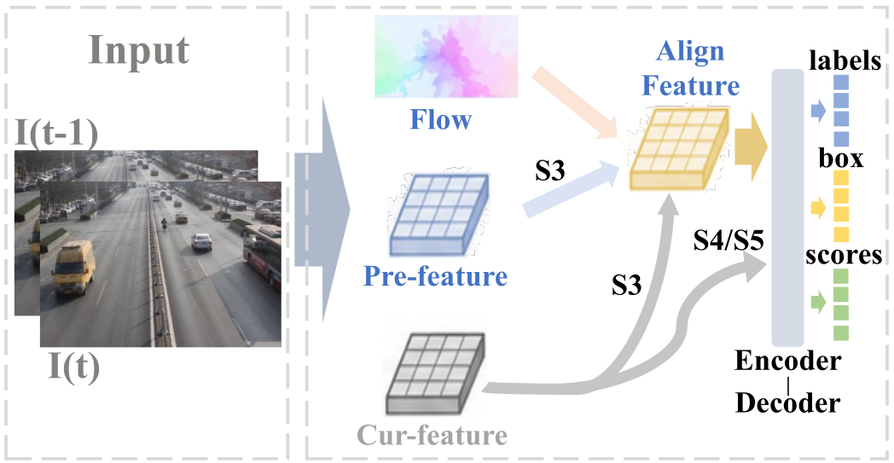
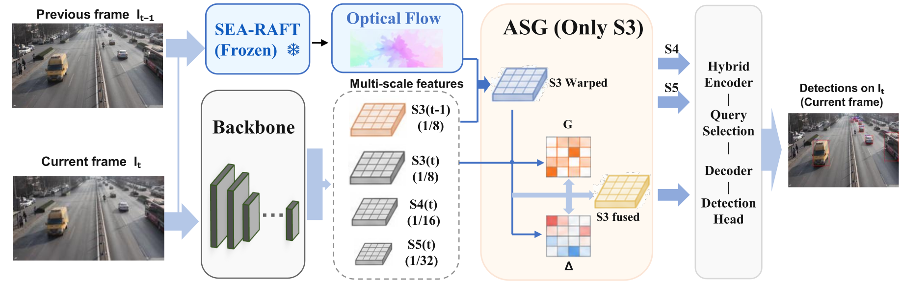
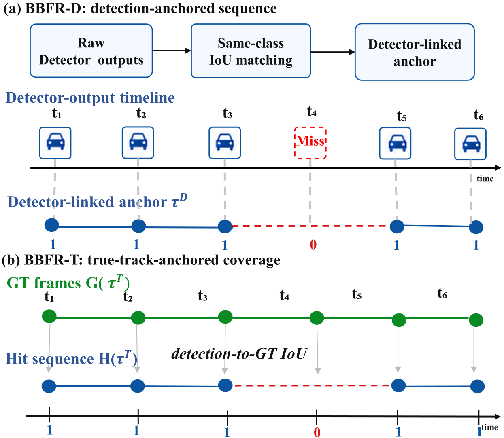
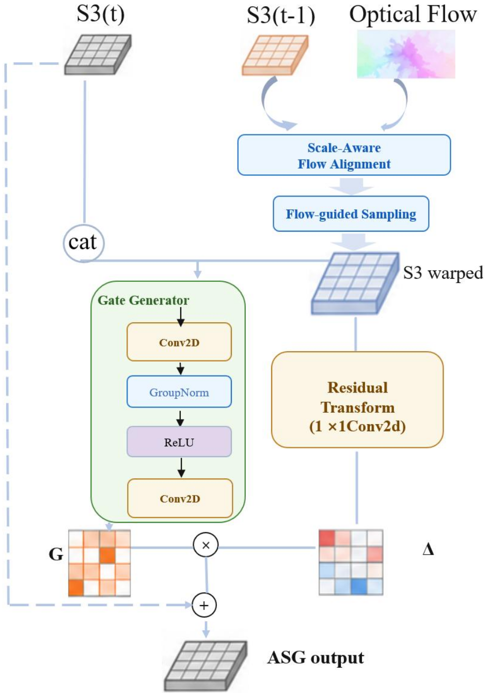
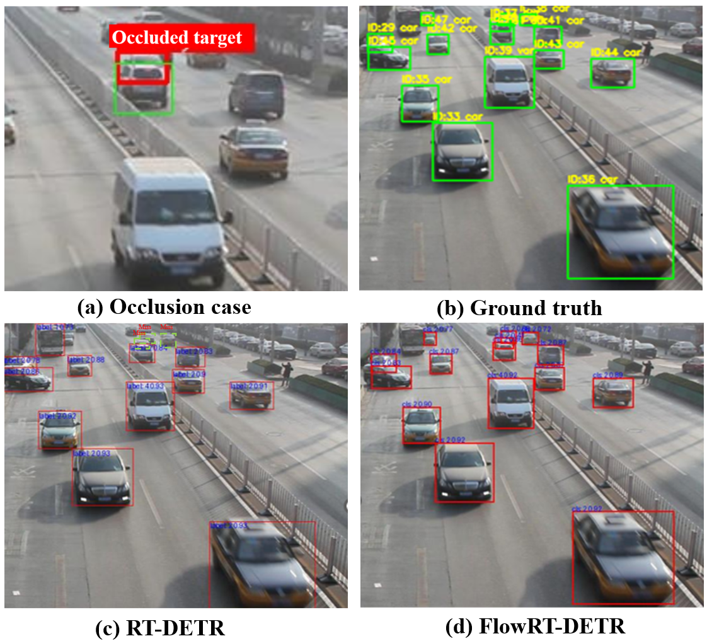

<div align="center">

# FlowRT-DETR

### Reducing Detection Flicker in Traffic Surveillance

[](LICENSE)


**Flow-guided RT-DETR with scale-aware gated fusion and a dedicated
bounding-box flicker metric.**

[中文说明](README_CN.md) · [Data](docs/DATA.md) · [Model card](docs/MODEL_CARD.md) · [Reproducibility](docs/REPRODUCIBILITY.md) · [BBFR](docs/BBFR.md)



</div>

## Overview

Frame-wise traffic detectors can be accurate and still flicker under blur,
occlusion, and small-object motion. FlowRT-DETR augments RT-DETR with frozen
SEA-RAFT motion cues and a lightweight scale-aware gated (ASG) residual module.
The default configuration fuses only the high-resolution S3 feature level to
balance temporal stability, accuracy, and runtime.

This repository also provides **Bounding-Box Flicker Rate (BBFR)**, tools for
paired-frame inference and flow/ASG visualization, fixed-threshold precision
and recall, latency benchmarking, and queue-stability analysis.

> **Release status.** Detector and SEA-RAFT weights are not distributed in this
> source snapshot. The table below reproduces results reported in the
> manuscript; it has not been re-run after repository cleanup. Read the
> [reproducibility notes](docs/REPRODUCIBILITY.md) before comparing runs.

## Highlights

- **Motion-guided detection:** frozen SEA-RAFT estimates motion from an earlier
  frame to the current frame.
- **Identity-initialized fusion:** ASG starts close to the single-frame model
  and learns a bounded temporal residual.
- **Video-safe pairing:** samples are grouped by `video_id` or sequence folder,
  preventing cross-video frame pairs.
- **Temporal evaluation:** BBFR-D and BBFR-T quantify detection flicker beyond
  conventional frame-wise mAP.
- **Research tooling:** inference, visualization, PR evaluation, latency
  measurement, failure-case mining, and queue analysis are included.

## Reported results

Results reported on the official UA-DETRAC video split in the manuscript.
BBFR is lower-is-better; all other accuracy metrics are higher-is-better.

| Method | mAP50 | mAP50:95 | mAP75 | Precision | Recall | F1 | BBFR-D ↓ | BBFR-T ↓ | Params | FPS |
|:--|--:|--:|--:|--:|--:|--:|--:|--:|--:|--:|
| RT-DETR-R18 | 71.1 | 55.4 | 65.3 | 60.4 | 82.5 | 69.7 | 30.15 | 10.72 | 20.1 M | 92.8 |
| **FlowRT-DETR-R18** | **76.6** | **59.6** | **70.9** | **69.8** | **86.2** | **77.1** | **25.51** | **9.57** | 20.2 M | 28.2 |

FPS was measured in the manuscript on one NVIDIA A800-SXM4-80GB. Runtime is
hardware-, software-, input-size-, and benchmark-protocol-dependent.

<div align="center">

</div>

## Installation

The research environment used Python 3.8, PyTorch 2.0.1, torchvision 0.15.2,
and CUDA 11.7. The code relies on torchvision's beta datapoints API, so newer
torchvision releases are not drop-in compatible.

```bash
conda create -n flowrtdetr python=3.8 -y
conda activate flowrtdetr

pip install torch==2.0.1 torchvision==0.15.2 \
  --index-url https://download.pytorch.org/whl/cu117
pip install -r requirements.txt
```

Alternatively, create the pinned Conda environment:

```bash
conda env create -f environment.yml
conda activate flowrtdetr
```

## Prepare assets

### 1. UA-DETRAC

Convert UA-DETRAC to COCO detection JSON and use this layout:

```text
data/ua_detrac/
├── annotations/
│   ├── train.json
│   └── val.json
└── images/
    ├── train/MVI_20011/img00001.jpg
    └── val/MVI_39031/img00001.jpg
```

Annotations should preserve sequence identity through `video_id` or the parent
folder in `file_name`; `frame_id` is recommended. See [DATA.md](docs/DATA.md).

### 2. SEA-RAFT

Download a checkpoint compatible with `optical_flow/config/kitti-S.json` from
the official [SEA-RAFT model zoo](https://github.com/princeton-vl/SEA-RAFT#model-zoo)
and place it at:

```text
optical_flow/weights/kitti-S.pth
```

SEA-RAFT remains frozen during detector training. Its checkpoint is excluded
from Git by design.

## Train and evaluate

Single GPU:

```bash
python tools/train.py \
  -c configs/flowrtdetr/flowrtdetr_r18_uadetrac.yml \
  --amp
```

Distributed training:

```bash
torchrun --nproc_per_node=4 tools/train.py \
  -c configs/flowrtdetr/flowrtdetr_r18_uadetrac.yml \
  --amp
```

Evaluation:

```bash
python tools/train.py \
  -c configs/flowrtdetr/flowrtdetr_r18_uadetrac.yml \
  -r output/flowrtdetr_r18_uadetrac/best.pth \
  --test-only
```

The released configuration defaults to `frame_offset: 2`, matching the
surviving experiment code snapshot. Change it to `1` for strictly adjacent
frames. Treat this as an experiment-defining parameter.

## Paired-frame inference

```bash
python tools/infer_pair.py \
  -c configs/flowrtdetr/flowrtdetr_r18_uadetrac.yml \
  -r path/to/best.pth \
  --prev-im-file path/to/earlier.jpg \
  --im-file path/to/current.jpg \
  --flow-ckpt optical_flow/weights/kitti-S.pth \
  -o output/inference.jpg
```

## BBFR evaluation

```bash
python tools/bbfr/eval_bbfr.py \
  -c configs/flowrtdetr/flowrtdetr_r18_uadetrac.yml \
  -r path/to/best.pth \
  --score-thresh 0.3 \
  --iou-thresh 0.5 \
  --max-lost 5 \
  --min-track-len 3 \
  --out-json output/bbfr.json
```

<div align="center">

</div>

## Visualization and benchmarking

```bash
# Visualize optical flow for one pair
python tools/visualize_flow_pair.py \
  --prev path/to/earlier.jpg --curr path/to/current.jpg \
  --flow-config optical_flow/config/kitti-S.json \
  --flow-ckpt optical_flow/weights/kitti-S.pth \
  -o output/flow_visualization

# Benchmark detector, flow, ASG, and end-to-end latency
python tools/benchmark.py \
  -c configs/flowrtdetr/flowrtdetr_r18_uadetrac.yml \
  -r path/to/best.pth \
  --flow-config optical_flow/config/kitti-S.json \
  --flow-ckpt optical_flow/weights/kitti-S.pth \
  --mode all
```

<details>
<summary><b>More qualitative examples</b></summary>

<p align="center">


</p>

</details>

## Repository layout

```text
configs/             RT-DETR baselines and FlowRT-DETR experiment configs
docs/                Data, BBFR, reproducibility notes, and manuscript figures
optical_flow/        Vendored SEA-RAFT implementation and configuration
src/                 Datasets, transforms, detector, losses, and solver
tools/               Training, inference, evaluation, visualization, benchmarks
.github/             CI, issue templates, and pull-request template
```

## Citation

The bibliographic record will be updated when a DOI or final publication record
is available.

```bibtex
@misc{wang2026flowrtdetr,
  title  = {Reducing Detection Flicker in Traffic Surveillance: A Flow-Guided
            RT-DETR With a Bounding-Box Flicker Metric},
  author = {Wang, Wenting and Wang, Bo},
  year   = {2026},
  note   = {Manuscript}
}
```

## Acknowledgements and license

FlowRT-DETR builds on [RT-DETR](https://github.com/lyuwenyu/RT-DETR) and
[SEA-RAFT](https://github.com/princeton-vl/SEA-RAFT). Project code is released
under [Apache-2.0](LICENSE). Vendored SEA-RAFT code retains its BSD 3-Clause
terms in [third_party/SEA-RAFT-LICENSE](third_party/SEA-RAFT-LICENSE). Dataset,
checkpoint, and manuscript-figure rights remain subject to their respective
licenses and ownership.
